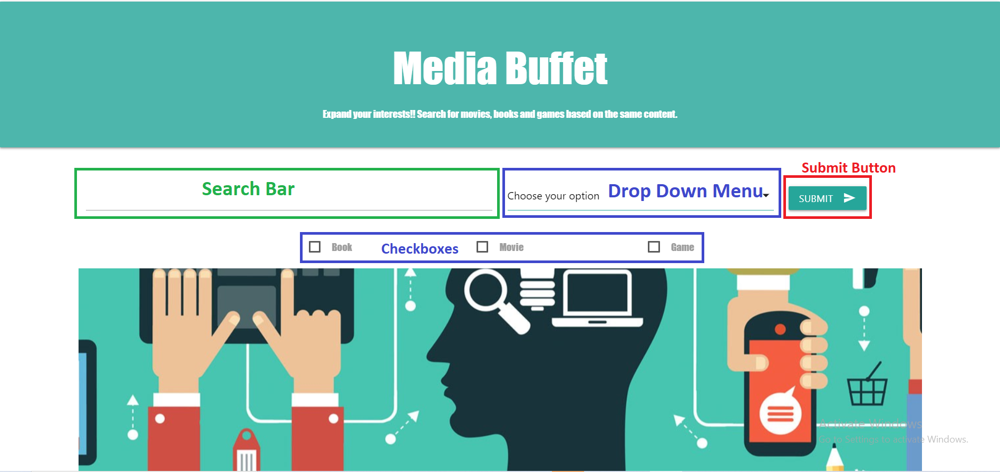
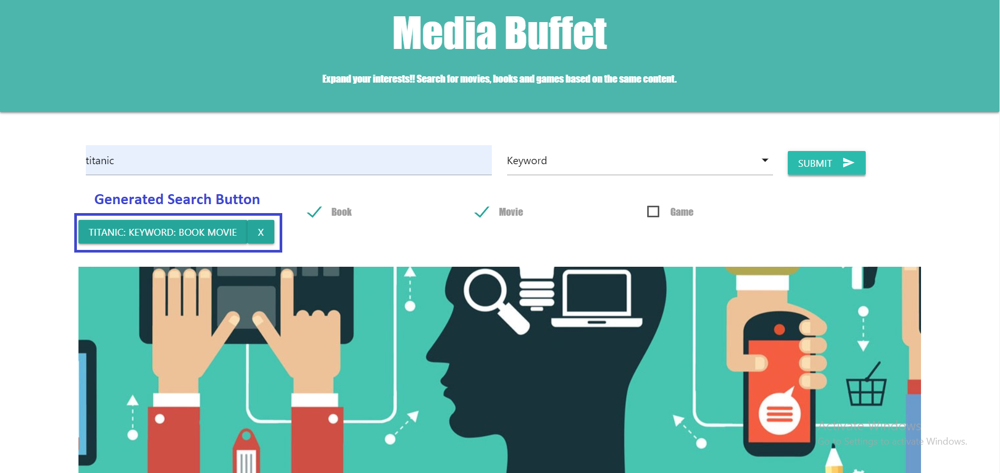
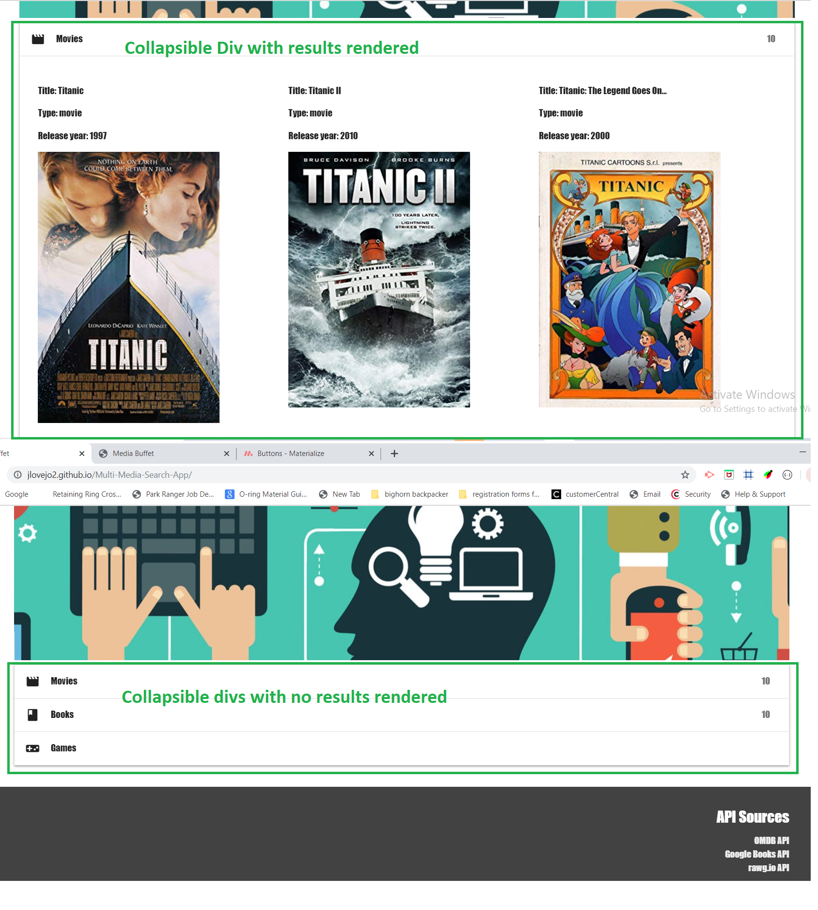

## Media Buffet: A Multi Media Search Tool Application

the link to our page is shown below:
https://jlovejo2.github.io/Multi-Media-Search-App/

## Table of Contents
* [Version 1.0](#version-1.0)
* [The User Interface](#the-user-interface)
* [How To Use](#how-to-use)
* [Apis Used](#apis-used)
* [CSS Framework](#css-framework)
* [Team Members](#team-members)
* [Coding Languages Used](#coding-languages-used)
* [Functions Used](#functions-used)
* [Known Issues With Code](#known-issues-with-code)

## Version 1.0
* Media Buffet is a website that can search movies, books, and video games to find like material.
* For example: Really enjoy the Thor movies? Want to learn what books and games are out there featuring the characters from Thor? Search by keyword Thor to get back multiple multi-media results based on the character Thor. 

## The User Interface:
* The landing page contains a search bar, dropdown menu to select your search criteria (title or keyword), checkbox buttons to select your options, and a submit button that renders the results based on the user's selections. 

* The landing page will also generate a button under the search criteria location that stores that data of the search and will perform the search again when clicked.  Also has a close button to remove it.

* At the bottom of the page there are collapsible elements that the results are generated into, broken down by selection (Movies, Books, Games). When results are generated into the collabisble they are automatically set to open and there is a badge at the top that (ideally) brings back the number of search results.

## How To Use
* The user types in a desired value into search input
* Then the user chooses their option from the dropwdown menu
* After that they decide what combination of movies,books, and games they want and select desired with checkboxes.
* Note: Modals will let user no when they forget to select search criteria
* To start search they click the submit button on the right

## API's Used:
Movies - OMDB: Open Movie Database
Books - Google Books
Games - RAWG

## CSS Framework:
Materialize

## Team Members:
James Lovejoy
Kobii Hoyos-Watkins
Martin Munoz
Sergio Perez
Iliana Vargas

## Coding Languages Used
* HTML
* Materialize
* CSS
* Javascript
* jquery

## Functions Used

## Known Issues With Code
